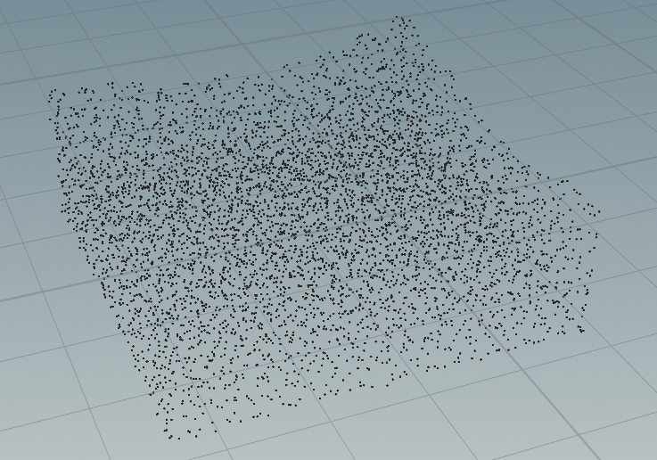

In `test.cpp`, modify the initial `.ply` file and the output path. The first argument of the constructor is the path to the fluid file, and the second argument is the path for result output.

Currently, only point cloud simulation is supported. The parameters are stored in the private member variables of `DFSPHSolver.h`, and the interface has not been implemented yet.

The project requirements include **CMake** and a properly installed version of **CUDA**.

run:
```bash
mkdir build
cd build

cmake ../
```
Alternatively, Use **CLion** to handle the build process.

